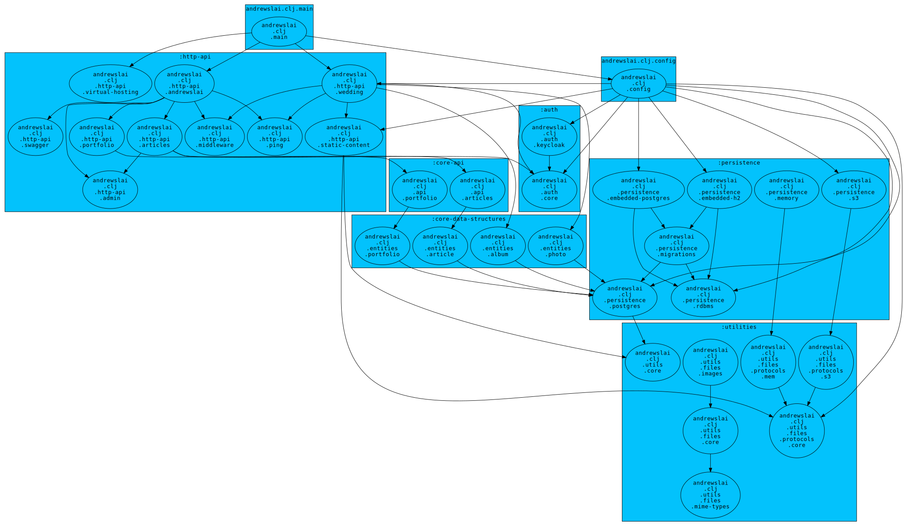

# NS-Analyzer

A static namespace analyzer/visualization tool for "seeing" a Clojure project's
architecture.

Useful for visualizing how your namespaces depend on one another, and grouping
them into meaningful units.

